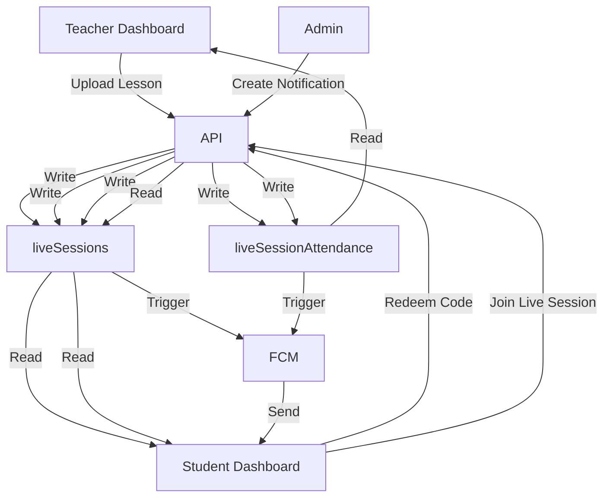
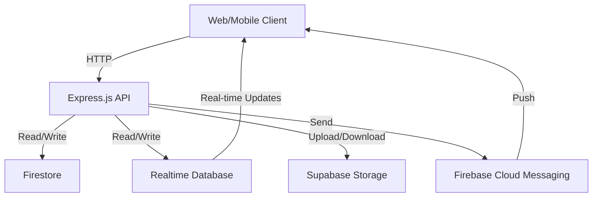
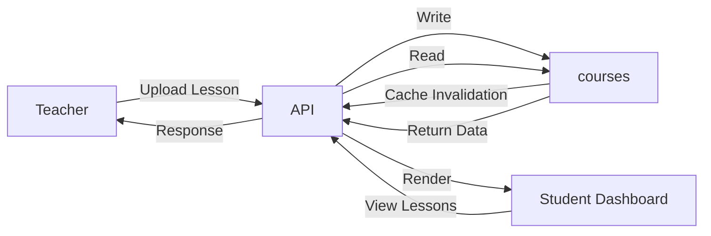
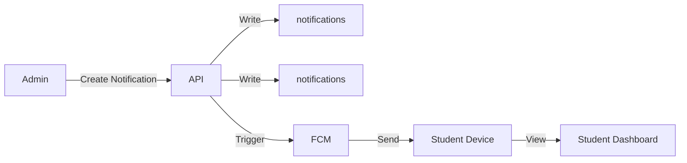

# DATABASE ARCHITECTURE AUDIT

## Executive Summary
This audit provides a comprehensive analysis of the **Almumayaz V8** project's database architecture, focusing on Firebase usage, data flows, risks, and feature dependencies. The project employs a **dual-database architecture** (Firestore and Realtime Database) with Supabase Storage for file uploads. Key findings include:

- **Dual-write inconsistency risks** between Firestore and RTDB.
- **Heavy reliance on RTDB** for real-time features (e.g., chat, live attendance).
- **Supabase Storage** is used instead of Firebase Storage for file uploads.
- **No traditional Cloud Functions** are implemented; equivalent logic is embedded in the Express.js API.
- **Caching layer** is implemented for Firestore reads but may serve stale data.
- **Authentication** is handled via Firebase Auth with local password hashing fallback.

---

## Firebase SDK Usage

| **File Path**               | **Line Number** | **Instance**          | **Context**                                      |
|-----------------------------|----------------|-----------------------|--------------------------------------------------|
| `firebase-admin.js`         | 1              | `initializeApp`       | Firebase initialization with service account     |
| `firebase-admin.js`         | 52             | `getAuth`             | Firebase Authentication initialization           |
| `firebase-admin.js`         | 66             | `admin.database()`    | Realtime Database initialization                 |
| `services/firestore.js`     | 2              | `getFirestore`        | Firestore initialization                         |
| `firebase-admin.js`         | 3              | `firebase-admin`      | Firebase Admin SDK import                        |
| `app.js`                    | 9              | `admin`               | Firebase Admin SDK import for FCM and Auth       |

---

## Firestore Audit

### Collections & Subcollections

| **Collection**            | **File Path**       | **Line Number** | **Context**                                      |
|---------------------------|--------------------|----------------|--------------------------------------------------|
| `users`                   | `firebase-admin.js`| 10             | Migrated to Firestore                            |
| `courses`                 | `firebase-admin.js`| 10             | Migrated to Firestore                            |
| `payments`                | `firebase-admin.js`| 10             | Migrated to Firestore                            |
| `subscriptions`           | `firebase-admin.js`| 10             | Migrated to Firestore                            |
| `reviews`                 | `firebase-admin.js`| 10             | Migrated to Firestore                            |
| `supportTickets`          | `firebase-admin.js`| 10             | Migrated to Firestore                            |
| `notes`                   | `firebase-admin.js`| 10             | Migrated to Firestore                            |
| `quotes`                  | `firebase-admin.js`| 10             | Migrated to Firestore                            |
| `questionBanks`           | `firebase-admin.js`| 10             | Migrated to Firestore                            |
| `announcements`           | `firebase-admin.js`| 10             | Migrated to Firestore                            |
| `liveSessions`            | `firebase-admin.js`| 10             | Migrated to Firestore                            |
| `parentInvites`           | `firebase-admin.js`| 10             | Migrated to Firestore                            |
| `chargeCodes`             | `firebase-admin.js`| 10             | Migrated to Firestore                            |

### Documents

| **Document Path**          | **File Path**       | **Line Number** | **Context**                                      |
|----------------------------|--------------------|----------------|--------------------------------------------------|
| `users/{uid}`             | `firebase-admin.js`| 297            | Direct Firestore document read                   |
| `users/{id}`              | `app.js`           | 4043           | Student analytics                                |
| `courses/{id}`            | `app.js`           | 5009           | Course quiz management                           |

### Queries

| **Query**                  | **File Path**               | **Line Number** | **Collection** | **Details**                                      |
|----------------------------|----------------------------|----------------|---------------|--------------------------------------------------|
| `where()`                  | `services/firestore.js`    | 329            | Any           | Generic query support                            |

### Write Operations

| **Operation**              | **File Path**               | **Line Number** | **Collection/Document** | **Details**                                      |
|----------------------------|----------------------------|----------------|------------------------|--------------------------------------------------|
| `setDoc()`                 | `services/firestore.js`    | 196            | Any                   | `ref.set(clean)`                                 |
| `updateDoc()`              | `services/firestore.js`    | 223            | Any                   | `ref.update(clean)`                              |
| `deleteDoc()`              | `services/firestore.js`    | 245            | Any                   | `ref.delete()`                                   |

---

## Realtime Database Audit

### Paths

| **Path**                     | **File Path**       | **Line Number** | **Operation Type** | **Context**                                      |
|------------------------------|--------------------|----------------|-------------------|--------------------------------------------------|
| `chats`                      | `firebase-admin.js`| 24             | Read/Write         | Real-time chat                                   |
| `chats/student-{id}`         | `app.js`           | 5332           | Delete             | Student chat cleanup                             |
| `_usage`                     | `firebase-admin.js`| 24             | Read/Write         | Usage tracking                                   |
| `_cronClaims`                | `firebase-admin.js`| 24             | Read/Write         | Cron job claims                                  |
| `liveSessionAttendance`      | `firebase-admin.js`| 24             | Read/Write         | Live session attendance                          |
| `notifications`              | `firebase-admin.js`| 24             | Read/Write         | Notifications (RTDB)                             |
| `zoomAppCredentials`         | `firebase-admin.js`| 24             | Read/Write         | Zoom credentials                                 |
| `zoomCredentials`            | `firebase-admin.js`| 24             | Read/Write         | Zoom credentials                                 |
| `settings`                   | `firebase-admin.js`| 24             | Read/Write         | App settings                                     |

### Read/Write Operations

| **Operation**                          | **File Path**       | **Line Number** | **Path**               | **Context**                                      |
|----------------------------------------|--------------------|----------------|-----------------------|--------------------------------------------------|
| `fbDb.ref(path).once('value')`         | `firebase-admin.js`| 226            | Any                   | Read operation                                   |
| `fbDb.ref(path).set(data)`             | `firebase-admin.js`| 279            | Any                   | Write operation                                  |
| `fbDb.ref(path).update(partial)`       | `firebase-admin.js`| 330            | Any                   | Update operation                                 |
| `fbDb.ref(path).remove()`              | `firebase-admin.js`| 438            | Any                   | Delete operation                                 |
| `fbDb.ref(path).push(data)`            | `firebase-admin.js`| 418            | Any                   | Push operation                                   |

---

## Storage Audit

### Operations

| **Operation** | **File Path** | **Line Number** | **Storage Path**       | **Context**                                      |
|--------------|--------------|----------------|-----------------------|--------------------------------------------------|
| Upload       | `app.js`     | 272            | `receipts/{paymentId}` | Payment receipt upload (Supabase)                |
| Upload       | `app.js`     | 5026           | `notes/{noteId}`      | Note file upload (Supabase)                      |
| Upload       | `app.js`     | 5075           | `questionBanks/{bankId}` | Question bank file upload (Supabase)          |

### File URL Storage & Retrieval
- **Supabase Storage** is used instead of Firebase Storage.
- File URLs are stored in Firestore documents (e.g., `notes.fileUrl`, `questionBanks.fileUrl`).
- Retrieval is done via direct URL access.

---

## Authentication Audit

### Login/Signup Flows

| **Operation**                     | **File Path** | **Line Number** | **Context**                                      |
|------------------------------------|--------------|----------------|--------------------------------------------------|
| `fbAuth.verifyIdToken(idToken)`    | `app.js`     | 1046           | Admin Firebase login                             |
| `scryptHash(password)`             | `app.js`     | 51             | Local password hashing                           |
| `verifyPassword(stored, plain)`    | `app.js`     | 60             | Local password verification                      |
| `fbAuth.updateUser(uid, { password })` | `app.js` | 1035       | Password reset                                   |

### Session Management

| **Operation**       | **File Path** | **Line Number** | **Context**                                      |
|--------------------|--------------|----------------|--------------------------------------------------|
| `req.session.user`  | `app.js`     | 1001           | Session creation after login                     |
| `req.session.destroy()` | `app.js` | 1068           | Logout                                           |

---

## API Audit

| **Endpoint**                              | **File Path** | **Line Number** | **Purpose**                                      | **Database Usage**                     | **Read/Write Operations**                     |
|-------------------------------------------|--------------|----------------|--------------------------------------------------|----------------------------------------|-----------------------------------------------|
| `POST /api/auth/firebase-admin-login`     | `app.js`     | 1043           | Admin Firebase login                             | Firestore (`users`)                    | Read (`readData('users')`)                   |
| `POST /api/student/progress`              | `app.js`     | 3100           | Update student progress                          | Firestore (`users`)                    | Write (`updateData('users/{uid}', { progress })`) |
| `GET /api/admin/analytics/student/:studentId` | `app.js` | 4039      | Student progress analytics                       | Firestore (`users`, `courses`)         | Read (`readData('users')`, `readData('courses')`) |
| `POST /api/admin/courses`                 | `app.js`     | 4920           | Create course                                    | Firestore (`courses`)                  | Write (`writeData('courses', courses)`)       |

---

## Cloud Functions Audit

| **Function**                     | **File Path**       | **Line Number** | **Trigger**       | **Database Actions**                             |
|----------------------------------|--------------------|----------------|------------------|--------------------------------------------------|
| `migrateSeedData`                | `firebase-admin.js`| 575            | Startup          | Writes seed data to Firestore and RTDB           |
| `checkScheduledNotifications`    | `app.js`           | 6054           | Scheduled (30s)  | Reads/writes `scheduledNotifications`, sends FCM |

---

## Feature Audit

### Upload Lesson

| **File Path** | **Line Number** | **Database Usage** | **Read/Write Operations**                     | **Data Flow**                                      |
|--------------|----------------|-------------------|-----------------------------------------------|----------------------------------------------------|
| `app.js`     | 4920-4990      | Firestore (`courses`) | Write (`writeData('courses', courses)`)        | Teacher → API → Firestore → Student Dashboard     |

### Notifications

| **File Path** | **Line Number** | **Database Usage**               | **Read/Write Operations**                     | **Data Flow**                                      |
|--------------|----------------|---------------------------------|-----------------------------------------------|----------------------------------------------------|
| `app.js`     | 5980-6050      | Firestore (`notifications`), RTDB (`notifications`) | Write (`writeData('notifications', notifications)`) | Admin → API → Firestore/RTDB → FCM → Student |

---

## Dependency Graph

---

## Duplicate Data Detection

| **File Path**       | **Line Number** | **Duplicate Data**       | **Context**                                      |
|--------------------|----------------|--------------------------|--------------------------------------------------|
| `firebase-admin.js`| 18-26          | `users`, `notifications` | Dual-write to Firestore and RTDB                 |

---

## Dead Code Detection

| **File Path** | **Line Number** | **Unused Entity** | **Context**                                      |
|--------------|----------------|------------------|--------------------------------------------------|
| `app.js`     | 1058-1063      | `/support` route  | Replaced by ticket system (commented as "old") |

---

## Risk Analysis

| **File Path**       | **Line Number** | **Risk/Bug**                     | **Severity** | **Context**                                      |
|--------------------|----------------|----------------------------------|-------------|--------------------------------------------------|
| `firebase-admin.js`| 262-284        | Dual-write inconsistency         | High        | Data may become inconsistent between Firestore and RTDB |
| `firebase-admin.js`| 220-245        | RTDB fallback race condition     | Medium      | Stale data may be served if Firestore fails      |
| `firebase-admin.js`| 193-215        | Cache inconsistency              | Medium      | Stale data may be served if cache invalidation fails |
| `app.js`           | 6054-6095      | Scheduled notification race condition | Medium | Multiple instances may process the same notification |

---

## Architecture Diagram

### Current Architecture

### Data Flow: Upload Lesson

### Data Flow: Notifications

---

## Final Conclusions

1. **Dual-Database Architecture**: The project uses both Firestore and RTDB, which introduces **inconsistency risks** if dual-write is enabled. RTDB is primarily used for real-time features (e.g., chat, live attendance).

2. **Storage**: Supabase Storage is used instead of Firebase Storage for file uploads (e.g., receipts, notes, question banks).

3. **Authentication**: Firebase Auth is used for admin login, while local password hashing is used for student accounts.

4. **Caching**: A caching layer is implemented for Firestore reads but may serve stale data if invalidation fails.

5. **Cloud Functions**: No traditional Cloud Functions are implemented; equivalent logic is embedded in the Express.js API.

6. **Key Risks**:
   - Dual-write inconsistency between Firestore and RTDB.
   - Race conditions in scheduled tasks (e.g., notifications).
   - Cache invalidation failures leading to stale data.

7. **Recommendations**:
   - **Disable dual-write** unless absolutely necessary, or implement a transactional outbox pattern.
   - **Migrate RTDB features** to Firestore where possible to reduce complexity.
   - **Implement proper cache invalidation** to avoid stale data.
   - **Add monitoring** for scheduled tasks to detect race conditions.

---

**Audit Date**: 2026-07-27