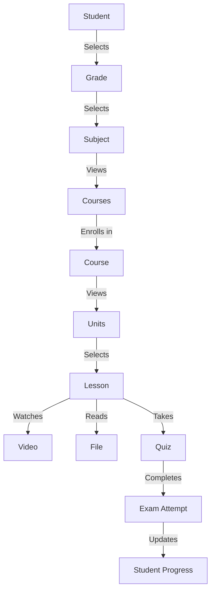
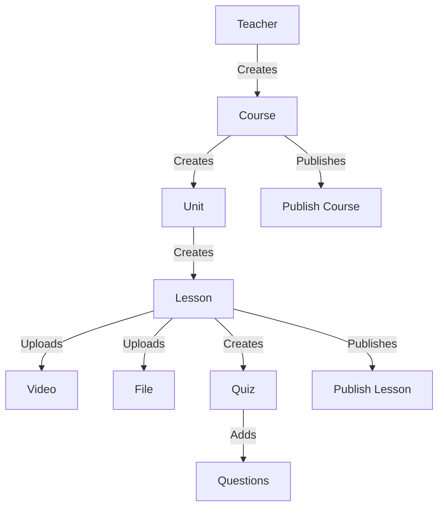

# DATABASE V2 BLUEPRINT

## 1. Project Philosophy

### **Core Principles**
1. **Student-Centric Design**
   - Every architectural decision prioritizes the student learning experience.
   - Mobile-first approach with offline capabilities.
   - Personalized progress tracking and adaptive learning paths.

2. **Single Source of Truth**
   - Firestore is the **primary and authoritative** database for all persistent data.
   - Realtime Database is **only** used for ephemeral, real-time interactions (chat, presence, live sync).

3. **Scalability by Design**
   - Collections are designed to scale horizontally.
   - No deep nesting; relationships are managed via references, not embedding.
   - Optimized for high read/write throughput.

4. **Data Integrity & Consistency**
   - Strong relationships with foreign key constraints.
   - Transactions for critical operations (e.g., payments, enrollments).
   - Audit logs for all modifications.

5. **Security-First**
   - Least privilege access control.
   - Field-level security rules.
   - Sensitive data encrypted at rest and in transit.

6. **Cost Efficiency**
   - Minimize reads/writes through intelligent caching and indexing.
   - Batch operations to reduce costs.
   - Media storage optimized for cost and performance.

7. **Future-Proof**
   - Modular design to accommodate future expansion (e.g., multiple teachers, AI, desktop apps).
   - Versioned schemas to support backward compatibility.
   - Extensible data model for new features (e.g., gamification, social learning).

8. **Operational Excellence**
   - Comprehensive logging and monitoring.
   - Automated backups and disaster recovery.
   - Clear migration paths for legacy data.

---

## 2. Database Principles

### **Source of Truth**
- **Firestore** is the **single source of truth** for all persistent data.
- **Realtime Database** is **only** used for:
  - Presence tracking (e.g., live session attendees).
  - Chat messages.
  - Live whiteboard sync.
  - Temporary live state (e.g., live session metadata).

### **Relationships**
- **One-to-Many**: Managed via **document references** (e.g., `courseId` in `lessons`).
- **Many-to-Many**: Managed via **junction collections** (e.g., `studentBookmarks`).
- **No Embedding**: Child entities are **never embedded** in parent documents.
- **Cascading Deletes**: Orphan records are **prevented** via security rules and cloud functions.

### **Document Size**
- **Maximum Document Size**: 1 MB (Firestore limit).
- **Target Document Size**: < 100 KB for optimal performance.
- **Arrays**: Limited to **100 items** per array to avoid performance issues.

### **Scalability**
- **Horizontal Scaling**: Collections are designed to scale horizontally.
- **Sharding**: Large collections (e.g., `analytics`) may be sharded by date or region.
- **Caching**: Frequently accessed data (e.g., `courses`, `lessons`) is cached client-side and server-side.

### **Naming**
- **Collections**: `camelCase`, singular (e.g., `users`, `courses`).
- **Documents**: `kebab-case` (e.g., `users/{userId}`, `courses/{courseId}`).
- **Fields**: `camelCase` (e.g., `createdAt`, `isPublished`).
- **Indexes**: Prefixed with `idx_` (e.g., `idx_courses_grade_stage`).

### **Versioning**
- **Schema Versioning**: All documents include a `schemaVersion` field (e.g., `schemaVersion: "2.0"`).
- **Backward Compatibility**: New fields are optional; old fields are deprecated but not removed.
- **Migration Paths**: Cloud functions handle schema migrations.

### **Soft Delete**
- **Soft Delete Field**: `isDeleted: boolean` (default `false`).
- **Deleted At Field**: `deletedAt: timestamp|null`.
- **Security Rules**: Soft-deleted documents are **invisible** to users but retained for recovery.
- **Permanent Deletion**: Cloud functions permanently delete soft-deleted documents after 30 days.

### **Audit Logs**
- **Audit Collection**: `auditLogs/{logId}`.
- **Fields**:
  ```json
  {
    "id": "string",
    "entityType": "string (e.g., 'course', 'user')",
    "entityId": "string",
    "action": "string (CREATE|UPDATE|DELETE|RESTORE)",
    "performedBy": "string (userId)",
    "performedAt": "timestamp",
    "changes": "object (key-value pairs of changed fields)",
    "ipAddress": "string",
    "userAgent": "string"
  }
  ```
- **Automated Logging**: Cloud functions log all modifications to `auditLogs`.

---

## 3. Firestore Collections

### **users**
**Purpose**: Store all user accounts (students, teachers, parents, admins).

**Fields**:
```json
{
  "id": "string (userId, kebab-case)",
  "uid": "string (Firebase Auth UID)",
  "name": "string",
  "email": "string",
  "phone": "string",
  "parentPhone": "string|null",
  "avatar": "string (URL)",
  "role": "string (student|teacher|parent|admin)",
  "grade": "string|null (e.g., 'الأول الإعدادي')",
  "stage": "string (إعدادية|ثانوية)",
  "governorate": "string|null",
  "fcmToken": "string|null",
  "lastLogin": "timestamp",
  "createdAt": "timestamp",
  "updatedAt": "timestamp",
  "isDeleted": "boolean (default false)",
  "deletedAt": "timestamp|null",
  "schemaVersion": "string (default '2.0')"
}
```

**Indexes**:
- Single-field: `email`, `phone`, `role`, `grade`, `stage`.
- Composite: `(role, grade)`, `(role, stage)`.

**References**:
- `payments.userId` → `users.id`.
- `studentProgress.userId` → `users.id`.

**Security Rules**:
```javascript
match /users/{userId} {
  allow read: if request.auth != null && (request.auth.uid == userId || request.auth.token.role == 'admin');
  allow create: if request.auth != null && request.auth.uid == userId && request.resource.data.role == 'student';
  allow update: if request.auth != null && (request.auth.uid == userId || request.auth.token.role == 'admin');
  allow delete: if request.auth != null && request.auth.token.role == 'admin';
}
```

**Queries**:
- Get user by ID: `users/{userId}`.
- List students by grade/stage: `users.where('role', '==', 'student').where('grade', '==', 'الأول الإعدادي')`.

---

### **grades**
**Purpose**: Store all available grades (e.g., الأول الإعدادي, الثاني الإعدادي).

**Fields**:
```json
{
  "id": "string (kebab-case, e.g., 'al-awwal-al-i3dadi')",
  "name": "string (e.g., 'الأول الإعدادي')",
  "stage": "string (إعدادية|ثانوية)",
  "order": "number",
  "isActive": "boolean (default true)"
}
```

**Indexes**:
- Single-field: `stage`, `isActive`.
- Composite: `(stage, order)`.

**References**:
- `users.grade` → `grades.id`.
- `courses.grade` → `grades.id`.

**Security Rules**:
```javascript
match /grades/{gradeId} {
  allow read: if true;
  allow create, update, delete: if request.auth != null && request.auth.token.role == 'admin';
}
```

**Queries**:
- List all grades: `grades.where('isActive', '==', true).orderBy('order')`.

---

### **subjects**
**Purpose**: Store all available subjects (e.g., الرياضيات, العلوم).

**Fields**:
```json
{
  "id": "string (kebab-case, e.g., 'riyadiyat')",
  "name": "string (e.g., 'الرياضيات')",
  "icon": "string (Font Awesome icon)",
  "color": "string (hex color)",
  "isActive": "boolean (default true)"
}
```

**Indexes**:
- Single-field: `isActive`.

**References**:
- `courses.subjectId` → `subjects.id`.

**Security Rules**:
```javascript
match /subjects/{subjectId} {
  allow read: if true;
  allow create, update, delete: if request.auth != null && request.auth.token.role == 'admin';
}
```

**Queries**:
- List all subjects: `subjects.where('isActive', '==', true)`.

---

### **courses**
**Purpose**: Store all courses (e.g., الرياضيات للأول الإعدادي - الفصل الأول).

**Fields**:
```json
{
  "id": "string (kebab-case, e.g., 'riyadiyat-al-awwal-al-i3dadi-fasl-awwal')",
  "title": "string",
  "subtitle": "string|null",
  "description": "string",
  "icon": "string (Font Awesome icon)",
  "color": "string (hex color)",
  "grade": "string (e.g., 'al-awwal-al-i3dadi')",
  "subjectId": "string (reference to subjects)",
  "semester": "string (first|second)",
  "isPublished": "boolean (default false)",
  "isFree": "boolean (default false)",
  "price": "number|null",
  "teacherId": "string (reference to users)",
  "createdAt": "timestamp",
  "updatedAt": "timestamp",
  "publishedAt": "timestamp|null",
  "isDeleted": "boolean (default false)",
  "deletedAt": "timestamp|null",
  "schemaVersion": "string (default '2.0')"
}
```

**Indexes**:
- Single-field: `grade`, `subjectId`, `semester`, `isPublished`, `isFree`, `teacherId`.
- Composite: `(grade, subjectId)`, `(grade, semester)`, `(isPublished, publishedAt)`.

**References**:
- `units.courseId` → `courses.id`.
- `lessons.courseId` → `courses.id`.
- `studentProgress.courseId` → `courses.id`.

**Security Rules**:
```javascript
match /courses/{courseId} {
  allow read: if true;
  allow create, update: if request.auth != null && (request.auth.token.role == 'admin' || (request.auth.token.role == 'teacher' && request.resource.data.teacherId == request.auth.uid));
  allow delete: if request.auth != null && request.auth.token.role == 'admin';
}
```

**Queries**:
- List published courses by grade: `courses.where('grade', '==', 'al-awwal-al-i3dadi').where('isPublished', '==', true)`.
- List teacher's courses: `courses.where('teacherId', '==', 'teacherUserId')`.

---

### **units**
**Purpose**: Store units (e.g., الوحدة الأولى: الأعداد الطبيعية).

**Fields**:
```json
{
  "id": "string (kebab-case, e.g., 'al-wahda-al-ula-al-a3dad-al-tabi3iya')",
  "courseId": "string (reference to courses)",
  "title": "string",
  "description": "string|null",
  "order": "number",
  "isPublished": "boolean (default false)",
  "createdAt": "timestamp",
  "updatedAt": "timestamp",
  "isDeleted": "boolean (default false)",
  "deletedAt": "timestamp|null"
}
```

**Indexes**:
- Single-field: `courseId`, `order`, `isPublished`.
- Composite: `(courseId, order)`.

**References**:
- `lessons.unitId` → `units.id`.

**Security Rules**:
```javascript
match /units/{unitId} {
  allow read: if true;
  allow create, update: if request.auth != null && (request.auth.token.role == 'admin' || (request.auth.token.role == 'teacher' && get(/databases/$(database)/documents/courses/$(resource.data.courseId)).data.teacherId == request.auth.uid));
  allow delete: if request.auth != null && request.auth.token.role == 'admin';
}
```

**Queries**:
- List units by course: `units.where('courseId', '==', 'courseId').orderBy('order')`.

---

### **lessons**
**Purpose**: Store lessons (e.g., الدرس الأول: مقدمة في الأعداد الطبيعية).

**Fields**:
```json
{
  "id": "string (kebab-case, e.g., 'al-dars-al-awwal-muqaddima-fil-a3dad-al-tabi3iya')",
  "courseId": "string (reference to courses)",
  "unitId": "string (reference to units)",
  "title": "string",
  "description": "string|null",
  "order": "number",
  "isPublished": "boolean (default false)",
  "isFree": "boolean (default false)",
  "createdAt": "timestamp",
  "updatedAt": "timestamp",
  "publishedAt": "timestamp|null",
  "isDeleted": "boolean (default false)",
  "deletedAt": "timestamp|null"
}
```

**Indexes**:
- Single-field: `courseId`, `unitId`, `order`, `isPublished`, `isFree`.
- Composite: `(courseId, order)`, `(unitId, order)`.

**References**:
- `lessonVideos.lessonId` → `lessons.id`.
- `lessonFiles.lessonId` → `lessons.id`.
- `quizzes.lessonId` → `lessons.id`.
- `studentLessonProgress.lessonId` → `lessons.id`.

**Security Rules**:
```javascript
match /lessons/{lessonId} {
  allow read: if true;
  allow create, update: if request.auth != null && (request.auth.token.role == 'admin' || (request.auth.token.role == 'teacher' && get(/databases/$(database)/documents/courses/$(resource.data.courseId)).data.teacherId == request.auth.uid));
  allow delete: if request.auth != null && request.auth.token.role == 'admin';
}
```

**Queries**:
- List lessons by course: `lessons.where('courseId', '==', 'courseId').orderBy('order')`.
- List lessons by unit: `lessons.where('unitId', '==', 'unitId').orderBy('order')`.

---

### **lessonVideos**
**Purpose**: Store videos for lessons.

**Fields**:
```json
{
  "id": "string (kebab-case, e.g., 'introduction-to-natural-numbers-video')",
  "lessonId": "string (reference to lessons)",
  "title": "string",
  "description": "string|null",
  "url": "string (YouTube URL)",
  "duration": "string (e.g., '12:34')",
  "order": "number",
  "isPublished": "boolean (default false)",
  "createdAt": "timestamp",
  "updatedAt": "timestamp",
  "isDeleted": "boolean (default false)",
  "deletedAt": "timestamp|null"
}
```

**Indexes**:
- Single-field: `lessonId`, `order`, `isPublished`.
- Composite: `(lessonId, order)`.

**References**:
- `studentLessonProgress.videoId` → `lessonVideos.id`.

**Security Rules**:
```javascript
match /lessonVideos/{videoId} {
  allow read: if true;
  allow create, update: if request.auth != null && (request.auth.token.role == 'admin' || (request.auth.token.role == 'teacher' && get(/databases/$(database)/documents/lessons/$(resource.data.lessonId)).data.courseId == get(/databases/$(database)/documents/courses/$(get(/databases/$(database)/documents/lessons/$(resource.data.lessonId)).data.courseId)).data.teacherId));
  allow delete: if request.auth != null && request.auth.token.role == 'admin';
}
```

**Queries**:
- List videos by lesson: `lessonVideos.where('lessonId', '==', 'lessonId').orderBy('order')`.

---

### **lessonFiles**
**Purpose**: Store files (PDFs, images) for lessons.

**Fields**:
```json
{
  "id": "string (kebab-case, e.g., 'natural-numbers-worksheet')",
  "lessonId": "string (reference to lessons)",
  "title": "string",
  "description": "string|null",
  "fileUrl": "string (PDF/image URL)",
  "fileType": "string (pdf|image)",
  "order": "number",
  "isPublished": "boolean (default false)",
  "createdAt": "timestamp",
  "updatedAt": "timestamp",
  "isDeleted": "boolean (default false)",
  "deletedAt": "timestamp|null"
}
```

**Indexes**:
- Single-field: `lessonId`, `order`, `isPublished`, `fileType`.
- Composite: `(lessonId, order)`.

**Security Rules**:
```javascript
match /lessonFiles/{fileId} {
  allow read: if true;
  allow create, update: if request.auth != null && (request.auth.token.role == 'admin' || (request.auth.token.role == 'teacher' && get(/databases/$(database)/documents/lessons/$(resource.data.lessonId)).data.courseId == get(/databases/$(database)/documents/courses/$(get(/databases/$(database)/documents/lessons/$(resource.data.lessonId)).data.courseId)).data.teacherId));
  allow delete: if request.auth != null && request.auth.token.role == 'admin';
}
```

**Queries**:
- List files by lesson: `lessonFiles.where('lessonId', '==', 'lessonId').orderBy('order')`.

---

### **quizzes**
**Purpose**: Store quizzes for lessons or courses.

**Fields**:
```json
{
  "id": "string (kebab-case, e.g., 'natural-numbers-quiz')",
  "courseId": "string (reference to courses)",
  "lessonId": "string|null (reference to lessons)",
  "title": "string",
  "description": "string|null",
  "passPct": "number (default 70)",
  "timerMinutes": "number|null",
  "isPublished": "boolean (default false)",
  "createdAt": "timestamp",
  "updatedAt": "timestamp",
  "isDeleted": "boolean (default false)",
  "deletedAt": "timestamp|null"
}
```

**Indexes**:
- Single-field: `courseId`, `lessonId`, `isPublished`.
- Composite: `(courseId, lessonId)`.

**References**:
- `questions.quizId` → `quizzes.id`.
- `studentExamAttempts.quizId` → `quizzes.id`.

**Security Rules**:
```javascript
match /quizzes/{quizId} {
  allow read: if true;
  allow create, update: if request.auth != null && (request.auth.token.role == 'admin' || (request.auth.token.role == 'teacher' && get(/databases/$(database)/documents/courses/$(resource.data.courseId)).data.teacherId == request.auth.uid));
  allow delete: if request.auth != null && request.auth.token.role == 'admin';
}
```

**Queries**:
- List quizzes by course: `quizzes.where('courseId', '==', 'courseId').where('isPublished', '==', true)`.
- List quizzes by lesson: `quizzes.where('lessonId', '==', 'lessonId').where('isPublished', '==', true)`.

---

### **questions**
**Purpose**: Store questions for quizzes or question banks.

**Fields**:
```json
{
  "id": "string (kebab-case, e.g., 'what-is-2-plus-2')",
  "quizId": "string|null (reference to quizzes)",
  "questionBankId": "string|null (reference to questionBanks)",
  "text": "string",
  "type": "string (mcq|truefalse|shortanswer)",
  "options": "array (for mcq)",
  "correctAnswer": "string|boolean|array (depends on type)",
  "explanation": "string|null",
  "order": "number",
  "isPublished": "boolean (default false)",
  "createdAt": "timestamp",
  "updatedAt": "timestamp",
  "isDeleted": "boolean (default false)",
  "deletedAt": "timestamp|null"
}
```

**Indexes**:
- Single-field: `quizId`, `questionBankId`, `order`, `isPublished`.
- Composite: `(quizId, order)`, `(questionBankId, order)`.

**Security Rules**:
```javascript
match /questions/{questionId} {
  allow read: if true;
  allow create, update: if request.auth != null && (request.auth.token.role == 'admin' || (request.auth.token.role == 'teacher' && (get(/databases/$(database)/documents/quizzes/$(resource.data.quizId)).data.courseId == get(/databases/$(database)/documents/courses/$(get(/databases/$(database)/documents/quizzes/$(resource.data.quizId)).data.courseId)).data.teacherId || get(/databases/$(database)/documents/questionBanks/$(resource.data.questionBankId)).data.courseId == get(/databases/$(database)/documents/courses/$(get(/databases/$(database)/documents/questionBanks/$(resource.data.questionBankId)).data.courseId)).data.teacherId)));
  allow delete: if request.auth != null && request.auth.token.role == 'admin';
}
```

**Queries**:
- List questions by quiz: `questions.where('quizId', '==', 'quizId').orderBy('order')`.
- List questions by question bank: `questions.where('questionBankId', '==', 'bankId').orderBy('order')`.

---

### **questionBanks**
**Purpose**: Store question banks for courses.

**Fields**:
```json
{
  "id": "string (kebab-case, e.g., 'natural-numbers-question-bank')",
  "courseId": "string (reference to courses)",
  "title": "string",
  "description": "string|null",
  "isPublished": "boolean (default false)",
  "createdAt": "timestamp",
  "updatedAt": "timestamp",
  "isDeleted": "boolean (default false)",
  "deletedAt": "timestamp|null"
}
```

**Indexes**:
- Single-field: `courseId`, `isPublished`.

**References**:
- `questions.questionBankId` → `questionBanks.id`.

**Security Rules**:
```javascript
match /questionBanks/{bankId} {
  allow read: if true;
  allow create, update: if request.auth != null && (request.auth.token.role == 'admin' || (request.auth.token.role == 'teacher' && get(/databases/$(database)/documents/courses/$(resource.data.courseId)).data.teacherId == request.auth.uid));
  allow delete: if request.auth != null && request.auth.token.role == 'admin';
}
```

**Queries**:
- List question banks by course: `questionBanks.where('courseId', '==', 'courseId').where('isPublished', '==', true)`.

---

### **subscriptions**
**Purpose**: Store subscription plans.

**Fields**:
```json
{
  "id": "string (kebab-case, e.g., 'premium-3-months')",
  "name": "string",
  "description": "string",
  "price": "number",
  "currency": "string (default 'EGP')",
  "durationDays": "number",
  "features": "array (e.g., ['unlimited-courses', 'priority-support'])',
  "isActive": "boolean (default true)",
  "createdAt": "timestamp",
  "updatedAt": "timestamp"
}
```

**Indexes**:
- Single-field: `isActive`.

**References**:
- `payments.subscriptionId` → `subscriptions.id`.

**Security Rules**:
```javascript
match /subscriptions/{subscriptionId} {
  allow read: if true;
  allow create, update, delete: if request.auth != null && request.auth.token.role == 'admin';
}
```

**Queries**:
- List active subscriptions: `subscriptions.where('isActive', '==', true)`.

---

### **payments**
**Purpose**: Store payment records.

**Fields**:
```json
{
  "id": "string (kebab-case, e.g., 'payment-20260727-abc123')",
  "userId": "string (reference to users)",
  "subscriptionId": "string (reference to subscriptions)",
  "amount": "number",
  "currency": "string (default 'EGP')",
  "method": "string (vodafone-cash|insta-pay|credit-card)",
  "status": "string (pending|completed|failed|refunded)",
  "transactionId": "string|null",
  "completedAt": "timestamp|null",
  "createdAt": "timestamp",
  "updatedAt": "timestamp"
}
```

**Indexes**:
- Single-field: `userId`, `subscriptionId`, `status`, `createdAt`.
- Composite: `(userId, createdAt)`, `(status, createdAt)`.

**References**:
- `paymentReceipts.paymentId` → `payments.id`.

**Security Rules**:
```javascript
match /payments/{paymentId} {
  allow read: if request.auth != null && (request.auth.uid == resource.data.userId || request.auth.token.role == 'admin');
  allow create: if request.auth != null && request.auth.uid == request.resource.data.userId;
  allow update: if request.auth != null && (request.auth.token.role == 'admin' || (request.auth.uid == resource.data.userId && request.resource.data.status != 'completed'));
  allow delete: if request.auth != null && request.auth.token.role == 'admin';
}
```

**Queries**:
- List user's payments: `payments.where('userId', '==', 'userId').orderBy('createdAt', 'desc')`.

---

### **paymentReceipts**
**Purpose**: Store payment receipts.

**Fields**:
```json
{
  "id": "string (kebab-case, e.g., 'receipt-20260727-abc123')",
  "paymentId": "string (reference to payments)",
  "fileUrl": "string (URL)",
  "uploadedAt": "timestamp",
  "uploadedBy": "string (userId)"
}
```

**Indexes**:
- Single-field: `paymentId`.

**Security Rules**:
```javascript
match /paymentReceipts/{receiptId} {
  allow read: if request.auth != null && (request.auth.uid == get(/databases/$(database)/documents/payments/$(resource.data.paymentId)).data.userId || request.auth.token.role == 'admin');
  allow create: if request.auth != null && request.auth.uid == get(/databases/$(database)/documents/payments/$(request.resource.data.paymentId)).data.userId;
  allow delete: if request.auth != null && request.auth.token.role == 'admin';
}
```

**Queries**:
- Get receipt by payment: `paymentReceipts.where('paymentId', '==', 'paymentId')`.

---

### **studentProgress**
**Purpose**: Track student progress across courses.

**Fields**:
```json
{
  "id": "string (kebab-case, e.g., 'user123-course456-progress')",
  "userId": "string (reference to users)",
  "courseId": "string (reference to courses)",
  "enrolledAt": "timestamp",
  "completedAt": "timestamp|null",
  "lastAccessedAt": "timestamp|null",
  "progressPct": "number (0-100)",
  "isCompleted": "boolean (default false)",
  "createdAt": "timestamp",
  "updatedAt": "timestamp"
}
```

**Indexes**:
- Single-field: `userId`, `courseId`, `isCompleted`.
- Composite: `(userId, courseId)`, `(userId, isCompleted)`.

**References**:
- `studentLessonProgress.progressId` → `studentProgress.id`.

**Security Rules**:
```javascript
match /studentProgress/{progressId} {
  allow read: if request.auth != null && (request.auth.uid == resource.data.userId || request.auth.token.role == 'admin' || (request.auth.token.role == 'teacher' && get(/databases/$(database)/documents/courses/$(resource.data.courseId)).data.teacherId == request.auth.uid));
  allow create, update: if request.auth != null && (request.auth.uid == resource.data.userId || request.auth.token.role == 'admin' || (request.auth.token.role == 'teacher' && get(/databases/$(database)/documents/courses/$(resource.data.courseId)).data.teacherId == request.auth.uid));
  allow delete: if request.auth != null && request.auth.token.role == 'admin';
}
```

**Queries**:
- Get student's progress in a course: `studentProgress.where('userId', '==', 'userId').where('courseId', '==', 'courseId')`.
- List student's enrolled courses: `studentProgress.where('userId', '==', 'userId')`.

---

### **studentLessonProgress**
**Purpose**: Track student progress in individual lessons.

**Fields**:
```json
{
  "id": "string (kebab-case, e.g., 'user123-lesson456-progress')",
  "progressId": "string (reference to studentProgress)",
  "lessonId": "string (reference to lessons)",
  "videoId": "string|null (reference to lessonVideos)",
  "watchTimeSec": "number (default 0)",
  "status": "string (not-started|in-progress|completed)",
  "completedAt": "timestamp|null",
  "createdAt": "timestamp",
  "updatedAt": "timestamp"
}
```

**Indexes**:
- Single-field: `progressId`, `lessonId`, `status`.
- Composite: `(progressId, lessonId)`, `(progressId, status)`.

**Security Rules**:
```javascript
match /studentLessonProgress/{progressId} {
  allow read: if request.auth != null && (request.auth.uid == get(/databases/$(database)/documents/studentProgress/$(resource.data.progressId)).data.userId || request.auth.token.role == 'admin' || (request.auth.token.role == 'teacher' && get(/databases/$(database)/documents/courses/$(get(/databases/$(database)/documents/lessons/$(resource.data.lessonId)).data.courseId)).data.teacherId == request.auth.uid));
  allow create, update: if request.auth != null && (request.auth.uid == get(/databases/$(database)/documents/studentProgress/$(resource.data.progressId)).data.userId || request.auth.token.role == 'admin' || (request.auth.token.role == 'teacher' && get(/databases/$(database)/documents/courses/$(get(/databases/$(database)/documents/lessons/$(resource.data.lessonId)).data.courseId)).data.teacherId == request.auth.uid));
  allow delete: if request.auth != null && request.auth.token.role == 'admin';
}
```

**Queries**:
- Get student's progress in a lesson: `studentLessonProgress.where('progressId', '==', 'progressId').where('lessonId', '==', 'lessonId')`.
- List student's lesson progress in a course: `studentLessonProgress.where('progressId', '==', 'progressId')`.

---

### **studentExamAttempts**
**Purpose**: Track student attempts at quizzes.

**Fields**:
```json
{
  "id": "string (kebab-case, e.g., 'user123-quiz456-attempt1')",
  "userId": "string (reference to users)",
  "quizId": "string (reference to quizzes)",
  "score": "number (0-100)",
  "isPassed": "boolean (default false)",
  "startedAt": "timestamp",
  "completedAt": "timestamp|null",
  "answers": "array (e.g., [{questionId: 'q1', answer: 'A', isCorrect: true}])",
  "createdAt": "timestamp",
  "updatedAt": "timestamp"
}
```

**Indexes**:
- Single-field: `userId`, `quizId`, `isPassed`.
- Composite: `(userId, quizId)`, `(userId, isPassed)`.

**Security Rules**:
```javascript
match /studentExamAttempts/{attemptId} {
  allow read: if request.auth != null && (request.auth.uid == resource.data.userId || request.auth.token.role == 'admin' || (request.auth.token.role == 'teacher' && get(/databases/$(database)/documents/courses/$(get(/databases/$(database)/documents/quizzes/$(resource.data.quizId)).data.courseId)).data.teacherId == request.auth.uid));
  allow create, update: if request.auth != null && (request.auth.uid == resource.data.userId || request.auth.token.role == 'admin' || (request.auth.token.role == 'teacher' && get(/databases/$(database)/documents/courses/$(get(/databases/$(database)/documents/quizzes/$(resource.data.quizId)).data.courseId)).data.teacherId == request.auth.uid));
  allow delete: if request.auth != null && request.auth.token.role == 'admin';
}
```

**Queries**:
- Get student's attempts for a quiz: `studentExamAttempts.where('userId', '==', 'userId').where('quizId', '==', 'quizId')`.
- List student's passed quizzes: `studentExamAttempts.where('userId', '==', 'userId').where('isPassed', '==', true)`.

---

### **studentBookmarks**
**Purpose**: Track student bookmarks (lessons, videos, files).

**Fields**:
```json
{
  "id": "string (kebab-case, e.g., 'user123-lesson456-bookmark')",
  "userId": "string (reference to users)",
  "lessonId": "string|null (reference to lessons)",
  "videoId": "string|null (reference to lessonVideos)",
  "fileId": "string|null (reference to lessonFiles)",
  "note": "string|null",
  "createdAt": "timestamp"
}
```

**Indexes**:
- Single-field: `userId`, `lessonId`, `videoId`, `fileId`.
- Composite: `(userId, lessonId)`, `(userId, videoId)`, `(userId, fileId)`.

**Security Rules**:
```javascript
match /studentBookmarks/{bookmarkId} {
  allow read, create, delete: if request.auth != null && request.auth.uid == resource.data.userId;
  allow update: if request.auth != null && request.auth.uid == resource.data.userId && request.resource.data.userId == resource.data.userId;
}
```

**Queries**:
- List student's bookmarks: `studentBookmarks.where('userId', '==', 'userId')`.
- Get bookmark for a lesson: `studentBookmarks.where('userId', '==', 'userId').where('lessonId', '==', 'lessonId')`.

---

### **studentNotes**
**Purpose**: Store student notes for lessons.

**Fields**:
```json
{
  "id": "string (kebab-case, e.g., 'user123-lesson456-note1')",
  "userId": "string (reference to users)",
  "lessonId": "string (reference to lessons)",
  "content": "string",
  "createdAt": "timestamp",
  "updatedAt": "timestamp"
}
```

**Indexes**:
- Single-field: `userId`, `lessonId`.
- Composite: `(userId, lessonId)`.

**Security Rules**:
```javascript
match /studentNotes/{noteId} {
  allow read, create, update, delete: if request.auth != null && request.auth.uid == resource.data.userId;
}
```

**Queries**:
- List student's notes for a lesson: `studentNotes.where('userId', '==', 'userId').where('lessonId', '==', 'lessonId')`.

---

### **notifications**
**Purpose**: Store notifications for users.

**Fields**:
```json
{
  "id": "string (kebab-case, e.g., 'user123-notification1')",
  "userId": "string|null (reference to users, null for role-based)",
  "role": "string|null (student|teacher|parent|admin, null for user-specific)",
  "title": "string",
  "body": "string",
  "data": "object|null (e.g., {courseId: 'course123'})",
  "isRead": "boolean (default false)",
  "createdAt": "timestamp",
  "updatedAt": "timestamp"
}
```

**Indexes**:
- Single-field: `userId`, `role`, `isRead`, `createdAt`.
- Composite: `(userId, isRead)`, `(role, isRead)`.

**Security Rules**:
```javascript
match /notifications/{notificationId} {
  allow read: if request.auth != null && (resource.data.userId == null || request.auth.uid == resource.data.userId || (resource.data.role != null && request.auth.token.role == resource.data.role));
  allow create: if request.auth != null && request.auth.token.role == 'admin';
  allow update: if request.auth != null && (request.auth.uid == resource.data.userId || request.auth.token.role == 'admin');
  allow delete: if request.auth != null && request.auth.token.role == 'admin';
}
```

**Queries**:
- List user's unread notifications: `notifications.where('userId', '==', 'userId').where('isRead', '==', false)`.
- List role-based notifications: `notifications.where('role', '==', 'student').where('isRead', '==', false)`.

---

### **notificationLogs**
**Purpose**: Log notification deliveries (FCM, email).

**Fields**:
```json
{
  "id": "string (kebab-case, e.g., 'notification123-log1')",
  "notificationId": "string (reference to notifications)",
  "userId": "string|null (reference to users)",
  "deliveryMethod": "string (fcm|email|sms)",
  "status": "string (sent|delivered|failed)",
  "deliveredAt": "timestamp|null",
  "createdAt": "timestamp"
}
```

**Indexes**:
- Single-field: `notificationId`, `userId`, `status`.

**Security Rules**:
```javascript
match /notificationLogs/{logId} {
  allow read: if request.auth != null && request.auth.token.role == 'admin';
  allow create: if request.auth != null && request.auth.token.role == 'admin';
}
```

**Queries**:
- List logs for a notification: `notificationLogs.where('notificationId', '==', 'notificationId')`.

---

### **reviews**
**Purpose**: Store course reviews.

**Fields**:
```json
{
  "id": "string (kebab-case, e.g., 'course123-review1')",
  "courseId": "string (reference to courses)",
  "userId": "string (reference to users)",
  "rating": "number (1-5)",
  "comment": "string|null",
  "isPublished": "boolean (default false)",
  "createdAt": "timestamp",
  "updatedAt": "timestamp"
}
```

**Indexes**:
- Single-field: `courseId`, `userId`, `rating`, `isPublished`.
- Composite: `(courseId, rating)`, `(courseId, isPublished)`.

**Security Rules**:
```javascript
match /reviews/{reviewId} {
  allow read: if true;
  allow create: if request.auth != null && request.auth.uid == request.resource.data.userId;
  allow update: if request.auth != null && (request.auth.uid == resource.data.userId || request.auth.token.role == 'admin');
  allow delete: if request.auth != null && (request.auth.uid == resource.data.userId || request.auth.token.role == 'admin');
}
```

**Queries**:
- List published reviews for a course: `reviews.where('courseId', '==', 'courseId').where('isPublished', '==', true)`.
- Get user's review for a course: `reviews.where('courseId', '==', 'courseId').where('userId', '==', 'userId')`.

---

### **announcements**
**Purpose**: Store global announcements.

**Fields**:
```json
{
  "id": "string (kebab-case, e.g., 'announcement1')",
  "title": "string",
  "body": "string",
  "isPublished": "boolean (default false)",
  "publishedAt": "timestamp|null",
  "createdAt": "timestamp",
  "updatedAt": "timestamp"
}
```

**Indexes**:
- Single-field: `isPublished`, `publishedAt`.

**Security Rules**:
```javascript
match /announcements/{announcementId} {
  allow read: if true;
  allow create, update, delete: if request.auth != null && request.auth.token.role == 'admin';
}
```

**Queries**:
- List published announcements: `announcements.where('isPublished', '==', true).orderBy('publishedAt', 'desc')`.

---

### **supportTickets**
**Purpose**: Store support tickets.

**Fields**:
```json
{
  "id": "string (kebab-case, e.g., 'ticket123')",
  "userId": "string (reference to users)",
  "subject": "string",
  "description": "string",
  "status": "string (open|in-progress|resolved|closed)",
  "priority": "string (low|medium|high)",
  "createdAt": "timestamp",
  "updatedAt": "timestamp",
  "resolvedAt": "timestamp|null"
}
```

**Indexes**:
- Single-field: `userId`, `status`, `priority`, `createdAt`.
- Composite: `(userId, status)`, `(status, priority)`.

**Security Rules**:
```javascript
match /supportTickets/{ticketId} {
  allow read: if request.auth != null && (request.auth.uid == resource.data.userId || request.auth.token.role == 'admin');
  allow create: if request.auth != null;
  allow update: if request.auth != null && (request.auth.token.role == 'admin' || (request.auth.uid == resource.data.userId && resource.data.status != 'closed'));
  allow delete: if request.auth != null && request.auth.token.role == 'admin';
}
```

**Queries**:
- List user's tickets: `supportTickets.where('userId', '==', 'userId').orderBy('createdAt', 'desc')`.
- List open tickets: `supportTickets.where('status', '==', 'open')`.

---

### **settings**
**Purpose**: Store global settings.

**Fields**:
```json
{
  "id": "string (kebab-case, e.g., 'settings')",
  "contactEmail": "string",
  "contactPhone": "string",
  "contactAddress": "string",
  "socialLinks": "object (e.g., {facebook: 'url', instagram: 'url'})",
  "paymentMethods": "object (e.g., {vodafoneCash: 'number', instaPay: 'number'})",
  "referralDiscount": "number (default 10)",
  "currentSemester": "string (first|second)",
  "announcementsEnabled": "boolean (default true)",
  "updatedAt": "timestamp"
}
```

**Security Rules**:
```javascript
match /settings/{settingsId} {
  allow read: if true;
  allow update: if request.auth != null && request.auth.token.role == 'admin';
}
```

**Queries**:
- Get settings: `settings/{settingsId}`.

---

### **parentInvites**
**Purpose**: Store parent invite tokens.

**Fields**:
```json
{
  "id": "string (kebab-case, e.g., 'invite123')",
  "studentId": "string (reference to users)",
  "parentEmail": "string",
  "token": "string",
  "expiresAt": "timestamp",
  "isUsed": "boolean (default false)",
  "usedAt": "timestamp|null",
  "createdAt": "timestamp"
}
```

**Indexes**:
- Single-field: `studentId`, `parentEmail`, `token`, `isUsed`.

**Security Rules**:
```javascript
match /parentInvites/{inviteId} {
  allow read: if request.auth != null && (request.auth.uid == resource.data.studentId || request.auth.token.role == 'admin');
  allow create: if request.auth != null && request.auth.uid == request.resource.data.studentId;
  allow update: if request.auth != null && (request.auth.token.role == 'admin' || (request.auth.uid == resource.data.studentId && !resource.data.isUsed));
  allow delete: if request.auth != null && request.auth.token.role == 'admin';
}
```

**Queries**:
- Get invite by token: `parentInvites.where('token', '==', 'token')`.
- List student's invites: `parentInvites.where('studentId', '==', 'studentId')`.

---

### **chargeCodes**
**Purpose**: Store charge codes for discounts.

**Fields**:
```json
{
  "id": "string (kebab-case, e.g., 'code123')",
  "code": "string",
  "discountPct": "number",
  "maxUses": "number|null",
  "usedCount": "number (default 0)",
  "expiresAt": "timestamp|null",
  "isActive": "boolean (default true)",
  "createdAt": "timestamp",
  "updatedAt": "timestamp"
}
```

**Indexes**:
- Single-field: `code`, `isActive`.

**Security Rules**:
```javascript
match /chargeCodes/{codeId} {
  allow read: if request.auth != null && request.auth.token.role == 'admin';
  allow create, update, delete: if request.auth != null && request.auth.token.role == 'admin';
}
```

**Queries**:
- Get code by value: `chargeCodes.where('code', '==', 'CODE123').where('isActive', '==', true)`.

---

### **analytics**
**Purpose**: Store analytics events.

**Fields**:
```json
{
  "id": "string (kebab-case, e.g., 'event123')",
  "userId": "string|null (reference to users)",
  "eventType": "string (e.g., 'lesson_start', 'quiz_complete')",
  "entityType": "string|null (e.g., 'lesson', 'quiz')",
  "entityId": "string|null",
  "metadata": "object|null",
  "createdAt": "timestamp"
}
```

**Indexes**:
- Single-field: `userId`, `eventType`, `entityType`, `entityId`, `createdAt`.
- Composite: `(userId, eventType)`, `(entityType, entityId)`.

**Security Rules**:
```javascript
match /analytics/{eventId} {
  allow read: if request.auth != null && request.auth.token.role == 'admin';
  allow create: if request.auth != null;
}
```

**Queries**:
- List events by user: `analytics.where('userId', '==', 'userId').orderBy('createdAt')`.
- List events by type: `analytics.where('eventType', '==', 'lesson_start')`.

---

## 4. Entity Relationship Diagram

```mermaid
%%{init: {'theme': 'base', 'themeVariables': { 'primaryColor': '#ffdfd3', 'edgeLabelBackground':'#fff', 'tertiaryColor': '#fff'}}}%%
erd
    %% Entities
    Users["Users
---
id: string
role: string
..."]
    Grades["Grades
---
id: string
stage: string
..."]
    Subjects["Subjects
---
id: string
name: string
..."]
    Courses["Courses
---
id: string
grade: string
subjectId: string
..."]
    Units["Units
---
id: string
courseId: string
..."]
    Lessons["Lessons
---
id: string
courseId: string
unitId: string
..."]
    LessonVideos["Lesson Videos
---
id: string
lessonId: string
..."]
    LessonFiles["Lesson Files
---
id: string
lessonId: string
..."]
    Quizzes["Quizzes
---
id: string
courseId: string
lessonId: string|null
..."]
    Questions["Questions
---
id: string
quizId: string|null
questionBankId: string|null
..."]
    QuestionBanks["Question Banks
---
id: string
courseId: string
..."]
    Subscriptions["Subscriptions
---
id: string
..."]
    Payments["Payments
---
id: string
userId: string
subscriptionId: string
..."]
    PaymentReceipts["Payment Receipts
---
id: string
paymentId: string
..."]
    StudentProgress["Student Progress
---
id: string
userId: string
courseId: string
..."]
    StudentLessonProgress["Student Lesson Progress
---
id: string
progressId: string
lessonId: string
..."]
    StudentExamAttempts["Student Exam Attempts
---
id: string
userId: string
quizId: string
..."]
    StudentBookmarks["Student Bookmarks
---
id: string
userId: string
lessonId: string|null
..."]
    StudentNotes["Student Notes
---
id: string
userId: string
lessonId: string
..."]
    Notifications["Notifications
---
id: string
userId: string|null
role: string|null
..."]
    NotificationLogs["Notification Logs
---
id: string
notificationId: string
..."]
    Reviews["Reviews
---
id: string
courseId: string
userId: string
..."]
    Announcements["Announcements
---
id: string
..."]
    SupportTickets["Support Tickets
---
id: string
userId: string
..."]
    Settings["Settings
---
id: string
..."]
    ParentInvites["Parent Invites
---
id: string
studentId: string
..."]
    ChargeCodes["Charge Codes
---
id: string
..."]
    Analytics["Analytics
---
id: string
userId: string|null
..."]

    %% Relationships
    Users ||--o{ Grades : "grade"
    Users ||--o{ Courses : "teacherId"
    Users ||--o{ Payments : "1:N (userId)"
    Users ||--o{ StudentProgress : "1:N (userId)"
    Users ||--o{ StudentLessonProgress : "1:N (via progressId)"
    Users ||--o{ StudentExamAttempts : "1:N (userId)"
    Users ||--o{ StudentBookmarks : "1:N (userId)"
    Users ||--o{ StudentNotes : "1:N (userId)"
    Users ||--o{ Notifications : "1:N (userId)"
    Users ||--o{ Reviews : "1:N (userId)"
    Users ||--o{ SupportTickets : "1:N (userId)"
    Users ||--o{ ParentInvites : "1:N (studentId)"
    Users ||--o{ Analytics : "1:N (userId)"

    Grades ||--o{ Courses : "1:N (grade)"
    Subjects ||--o{ Courses : "1:N (subjectId)"

    Courses ||--o{ Units : "1:N (courseId)"
    Courses ||--o{ Lessons : "1:N (courseId)"
    Courses ||--o{ Quizzes : "1:N (courseId)"
    Courses ||--o{ QuestionBanks : "1:N (courseId)"
    Courses ||--o{ StudentProgress : "1:N (courseId)"
    Courses ||--o{ Reviews : "1:N (courseId)"

    Units ||--o{ Lessons : "1:N (unitId)"

    Lessons ||--o{ LessonVideos : "1:N (lessonId)"
    Lessons ||--o{ LessonFiles : "1:N (lessonId)"
    Lessons ||--o{ Quizzes : "1:1 (lessonId)"
    Lessons ||--o{ StudentLessonProgress : "1:N (lessonId)"
    Lessons ||--o{ StudentBookmarks : "1:N (lessonId)"
    Lessons ||--o{ StudentNotes : "1:N (lessonId)"

    Quizzes ||--o{ Questions : "1:N (quizId)"
    QuestionBanks ||--o{ Questions : "1:N (questionBankId)"

    Subscriptions ||--o{ Payments : "1:N (subscriptionId)"

    Payments ||--o{ PaymentReceipts : "1:1 (paymentId)"

    StudentProgress ||--o{ StudentLessonProgress : "1:N (progressId)"

    Quizzes ||--o{ StudentExamAttempts : "1:N (quizId)"

    Notifications ||--o{ NotificationLogs : "1:N (notificationId)"
```

---

## 5. Student Learning Flow

### **Flow**


### **Step-by-Step Explanation**

1. **Student → Grade**
   - Student selects their **grade** (e.g., الأول الإعدادي) from the available grades.
   - **Data**: `grades` collection.
   - **Query**: `grades.where('isActive', '==', true).orderBy('order')`.

2. **Grade → Subject**
   - Student views **subjects** available for their grade.
   - **Data**: `subjects` collection.
   - **Query**: `subjects.where('isActive', '==', true)`.

3. **Subject → Courses**
   - Student views **courses** for the selected subject and grade.
   - **Data**: `courses` collection.
   - **Query**: `courses.where('grade', '==', 'gradeId').where('subjectId', '==', 'subjectId').where('isPublished', '==', true)`.

4. **Courses → Course**
   - Student **enrolls** in a course (free or paid).
   - **Data**: `studentProgress` collection.
   - **Action**: Create `studentProgress` document.
   - **Query**: `studentProgress.add({userId, courseId, enrolledAt: now})`.

5. **Course → Units**
   - Student views **units** in the course.
   - **Data**: `units` collection.
   - **Query**: `units.where('courseId', '==', 'courseId').orderBy('order')`.

6. **Units → Lesson**
   - Student selects a **lesson** from a unit.
   - **Data**: `lessons` collection.
   - **Query**: `lessons.where('unitId', '==', 'unitId').orderBy('order')`.

7. **Lesson → Video/File**
   - Student **watches videos** or **reads files** in the lesson.
   - **Data**: `lessonVideos` and `lessonFiles` collections.
   - **Query**: `lessonVideos.where('lessonId', '==', 'lessonId').orderBy('order')`.
   - **Action**: Update `studentLessonProgress` (watch time, status).

8. **Lesson → Quiz**
   - Student takes a **quiz** (if available for the lesson).
   - **Data**: `quizzes` and `questions` collections.
   - **Query**: `quizzes.where('lessonId', '==', 'lessonId').where('isPublished', '==', true)`.
   - **Action**: Create `studentExamAttempts` document.

9. **Quiz → Attempt**
   - Student **completes** the quiz attempt.
   - **Data**: `studentExamAttempts` collection.
   - **Action**: Update `studentExamAttempts` (score, isPassed, answers).

10. **Attempt → Progress**
    - System **updates student progress** in the course.
    - **Data**: `studentProgress` and `studentLessonProgress` collections.
    - **Action**: Update `studentProgress` (progressPct, isCompleted).

---

## 6. Teacher Workflow

### **Flow**


### **Step-by-Step Explanation**

1. **Teacher → Course**
   - Teacher **creates a course** (e.g., الرياضيات للأول الإعدادي - الفصل الأول).
   - **Data**: `courses` collection.
   - **Action**: Create `courses` document.
   - **Query**: `courses.add({title, grade, subjectId, teacherId: request.auth.uid, ...})`.

2. **Course → Unit**
   - Teacher **creates units** (e.g., الوحدة الأولى: الأعداد الطبيعية).
   - **Data**: `units` collection.
   - **Action**: Create `units` document.
   - **Query**: `units.add({title, courseId, order, ...})`.

3. **Unit → Lesson**
   - Teacher **creates lessons** (e.g., الدرس الأول: مقدمة في الأعداد الطبيعية).
   - **Data**: `lessons` collection.
   - **Action**: Create `lessons` document.
   - **Query**: `lessons.add({title, courseId, unitId, order, ...})`.

4. **Lesson → Video**
   - Teacher **uploads videos** for the lesson.
   - **Data**: `lessonVideos` collection.
   - **Action**: Create `lessonVideos` document.
   - **Query**: `lessonVideos.add({title, lessonId, url, order, ...})`.

5. **Lesson → File**
   - Teacher **uploads files** (PDFs, images) for the lesson.
   - **Data**: `lessonFiles` collection.
   - **Action**: Create `lessonFiles` document.
   - **Query**: `lessonFiles.add({title, lessonId, fileUrl, fileType, order, ...})`.

6. **Lesson → Quiz**
   - Teacher **creates a quiz** for the lesson.
   - **Data**: `quizzes` collection.
   - **Action**: Create `quizzes` document.
   - **Query**: `quizzes.add({title, courseId, lessonId, passPct, ...})`.

7. **Quiz → Questions**
   - Teacher **adds questions** to the quiz.
   - **Data**: `questions` collection.
   - **Action**: Create `questions` document.
   - **Query**: `questions.add({text, quizId, type, options, correctAnswer, ...})`.

8. **Lesson → Publish**
   - Teacher **publishes the lesson** (makes it visible to students).
   - **Data**: `lessons` collection.
   - **Action**: Update `lessons` document (`isPublished: true`, `publishedAt: now`).

9. **Course → Publish**
   - Teacher **publishes the course** (makes it visible to students).
   - **Data**: `courses` collection.
   - **Action**: Update `courses` document (`isPublished: true`, `publishedAt: now`).

---

## 7. Repository Structure

```
lib/
  repositories/
    user_repository.dart
    grade_repository.dart
    subject_repository.dart
    course_repository.dart
    unit_repository.dart
    lesson_repository.dart
    lesson_video_repository.dart
    lesson_file_repository.dart
    quiz_repository.dart
    question_repository.dart
    question_bank_repository.dart
    subscription_repository.dart
    payment_repository.dart
    payment_receipt_repository.dart
    student_progress_repository.dart
    student_lesson_progress_repository.dart
    student_exam_attempt_repository.dart
    student_bookmark_repository.dart
    student_note_repository.dart
    notification_repository.dart
    notification_log_repository.dart
    review_repository.dart
    announcement_repository.dart
    support_ticket_repository.dart
    setting_repository.dart
    parent_invite_repository.dart
    charge_code_repository.dart
    analytics_repository.dart
```

### **Repository Responsibilities**
- **CRUD Operations**: Create, Read, Update, Delete for the entity.
- **Query Building**: Construct Firestore queries.
- **Transaction Management**: Handle transactions for critical operations.
- **Validation**: Validate data before write operations.
- **Error Handling**: Convert Firestore errors to domain-specific exceptions.

### **Example: `course_repository.dart`**
```dart
class CourseRepository {
  final FirebaseFirestore _firestore;

  CourseRepository(this._firestore);

  Future<Course> create(Course course) async {
    final docRef = _firestore.collection('courses').doc();
    course.id = docRef.id;
    await docRef.set(course.toJson());
    return course;
  }

  Future<Course?> getById(String id) async {
    final snapshot = await _firestore.collection('courses').doc(id).get();
    return snapshot.exists ? Course.fromJson(snapshot.data()!) : null;
  }

  Future<List<Course>> listByGrade(String gradeId) async {
    final snapshot = await _firestore.collection('courses')
        .where('grade', isEqualTo: gradeId)
        .where('isPublished', isEqualTo: true)
        .orderBy('publishedAt', descending: true)
        .get();
    return snapshot.docs.map((doc) => Course.fromJson(doc.data())).toList();
  }

  Future<void> update(Course course) async {
    await _firestore.collection('courses').doc(course.id).update(course.toJson());
  }

  Future<void> delete(String id) async {
    await _firestore.collection('courses').doc(id).update({
      'isDeleted': true,
      'deletedAt': FieldValue.serverTimestamp(),
    });
  }
}
```

---

## 8. Service Layer

```
lib/
  services/
    auth_service.dart
    user_service.dart
    course_service.dart
    lesson_service.dart
    quiz_service.dart
    payment_service.dart
    progress_service.dart
    notification_service.dart
    analytics_service.dart
```

### **Service Responsibilities**
- **Business Logic**: Implement business rules (e.g., enrollment validation, payment processing).
- **Transaction Management**: Coordinate transactions across repositories.
- **Event Handling**: Publish events (e.g., `LessonPublished`, `PaymentCompleted`).
- **Integration**: Integrate with external services (e.g., FCM, payment gateways).
- **Caching**: Implement caching strategies for frequently accessed data.

### **Example: `course_service.dart`**
```dart
class CourseService {
  final CourseRepository _courseRepository;
  final UnitRepository _unitRepository;
  final LessonRepository _lessonRepository;
  final NotificationService _notificationService;

  CourseService(
    this._courseRepository,
    this._unitRepository,
    this._lessonRepository,
    this._notificationService,
  );

  Future<Course> createCourse(Course course) async {
    // Validate course data
    if (course.title.isEmpty) {
      throw ValidationException('Course title is required');
    }
    
    // Create course
    final createdCourse = await _courseRepository.create(course);
    
    // Publish event
    await _notificationService.publishEvent(
      CourseCreatedEvent(courseId: createdCourse.id),
    );
    
    return createdCourse;
  }

  Future<void> publishCourse(String courseId) async {
    // Start transaction
    await _firestore.runTransaction((transaction) async {
      final courseRef = _firestore.collection('courses').doc(courseId);
      final courseDoc = await transaction.get(courseRef);
      
      if (!courseDoc.exists) {
        throw NotFoundException('Course not found');
      }
      
      // Update course
      transaction.update(courseRef, {
        'isPublished': true,
        'publishedAt': FieldValue.serverTimestamp(),
      });
      
      // Publish event
      await _notificationService.publishEvent(
        CoursePublishedEvent(courseId: courseId),
      );
    });
  }
}
```

---

## 9. API Standards

### **Naming**
- **RESTful**: Use nouns for resources, pluralized (e.g., `/courses`, `/lessons`).
- **Versioning**: `/api/v2/...`.
- **Actions**: Use HTTP methods (GET, POST, PUT, DELETE) for CRUD operations.
- **Sub-Resources**: `/courses/{courseId}/lessons`.

### **Validation**
- **Request Validation**: Validate all request data (query params, body, headers).
- **Response Validation**: Validate all response data before sending.
- **Error Messages**: Provide clear, actionable error messages.

### **Errors**
- **Format**:
  ```json
  {
    "error": {
      "code": "string (e.g., 'invalid_request')",
      "message": "string (e.g., 'Course title is required')",
      "details": "object|null (e.g., {field: 'title', issue: 'required'})"
    }
  }
  ```
- **HTTP Status Codes**:
  - `200 OK`: Successful GET, PUT, DELETE.
  - `201 Created`: Successful POST.
  - `400 Bad Request`: Validation errors.
  - `401 Unauthorized`: Authentication required.
  - `403 Forbidden`: Permission denied.
  - `404 Not Found`: Resource not found.
  - `500 Internal Server Error`: Server errors.

### **Response Format**
- **Success**:
  ```json
  {
    "data": "object|array",
    "meta": {
      "pagination": {
        "total": "number",
        "limit": "number",
        "offset": "number"
      }
    }
  }
  ```

### **Pagination**
- **Cursor-Based**: Use `limit` and `cursor` for pagination.
- **Default Limit**: 20 items per page.
- **Max Limit**: 100 items per page.

### **Example API Endpoints**
| **Endpoint** | **Method** | **Description** | **Request Body** | **Response** |
|--------------|------------|----------------|------------------|--------------|
| `/api/v2/courses` | GET | List courses | Query params: `grade`, `subjectId`, `limit`, `cursor` | `{data: [Course], meta: {pagination}}` |
| `/api/v2/courses` | POST | Create course | `{title, grade, subjectId, ...}` | `{data: Course}` |
| `/api/v2/courses/{id}` | GET | Get course | - | `{data: Course}` |
| `/api/v2/courses/{id}` | PUT | Update course | `{title, ...}` | `{data: Course}` |
| `/api/v2/courses/{id}/publish` | POST | Publish course | - | `{data: Course}` |
| `/api/v2/courses/{id}/lessons` | GET | List lessons | Query params: `limit`, `cursor` | `{data: [Lesson], meta: {pagination}}` |
| `/api/v2/courses/{id}/lessons` | POST | Create lesson | `{title, order, ...}` | `{data: Lesson}` |

---

## 10. Firestore Standards

### **Document IDs**
- **Format**: `kebab-case` (e.g., `al-awwal-al-i3dadi`).
- **Generation**: Auto-generated by Firestore (`.doc()`).

### **Server Timestamp**
- **Field**: `createdAt`, `updatedAt`, `publishedAt`, `deletedAt`.
- **Value**: `FieldValue.serverTimestamp()`.

### **Transactions**
- **Use Case**: Critical operations (e.g., payments, enrollments).
- **Example**:
  ```javascript
  await firestore.runTransaction(async (transaction) => {
    const courseRef = firestore.collection('courses').doc(courseId);
    const courseDoc = await transaction.get(courseRef);
    
    if (!courseDoc.exists) {
      throw new Error('Course not found');
    }
    
    transaction.update(courseRef, {
      isPublished: true,
      publishedAt: FieldValue.serverTimestamp(),
    });
  });
  ```

### **Batch Writes**
- **Use Case**: Bulk operations (e.g., creating lessons with videos).
- **Example**:
  ```javascript
  const batch = firestore.batch();
  
  // Create lesson
  const lessonRef = firestore.collection('lessons').doc();
  batch.set(lessonRef, {
    title: 'Lesson 1',
    courseId,
    order: 1,
  });
  
  // Create videos
  const videoRef = firestore.collection('lessonVideos').doc();
  batch.set(videoRef, {
    title: 'Video 1',
    lessonId: lessonRef.id,
    url: 'https://youtube.com/...',
    order: 1,
  });
  
  await batch.commit();
  ```

### **Indexes**
- **Single-Field**: Automatically created by Firestore.
- **Composite**: Manually defined in `firestore.indexes.json`.
- **Naming**: `idx_{collection}_{field1}_{field2}`.

### **Example: `firestore.indexes.json`**
```json
{
  "indexes": [
    {
      "collectionGroup": "lessons",
      "queryScope": "COLLECTION",
      "fields": [
        {"fieldPath": "courseId", "order": "ASCENDING"},
        {"fieldPath": "order", "order": "ASCENDING"}
      ]
    },
    {
      "collectionGroup": "studentProgress",
      "queryScope": "COLLECTION",
      "fields": [
        {"fieldPath": "userId", "order": "ASCENDING"},
        {"fieldPath": "isCompleted", "order": "ASCENDING"}
      ]
    }
  ],
  "fieldOverrides": []
}
```

---

## 11. Realtime Database Standards

### **Allowed Nodes**
| **Node** | **Purpose** | **Fields** |
|-----------|-------------|------------|
| `presence` | Track user presence (online/offline) | `{userId: {lastSeen: timestamp, isOnline: boolean}}` |
| `chats` | Store chat messages | `{chatId: {messages: [{senderId, text, timestamp}]}}` |
| `liveAttendance` | Track live session attendance | `{sessionId: {userId: {joinTime, leaveTime}}}` |
| `whiteboard` | Sync whiteboard state | `{sessionId: {drawings: [...], lastUpdate: timestamp}}` |
| `liveState` | Temporary live session state | `{sessionId: {currentSlide, isPaused, ...}}` |

### **Forbidden Nodes**
- Any node not listed in **Allowed Nodes**.
- Persistent data (e.g., courses, lessons, users).
- Sensitive data (e.g., payments, personal info).

### **Security Rules**
```json
{
  "rules": {
    "presence": {
      ".read": "auth != null",
      ".write": "auth != null && newData.child('userId').val() == auth.uid"
    },
    "chats": {
      "$chatId": {
        ".read": "auth != null && root.child('chats/' + $chatId + '/participants').child(auth.uid).exists()",
        ".write": "auth != null && root.child('chats/' + $chatId + '/participants').child(auth.uid).exists()"
      }
    },
    "liveAttendance": {
      "$sessionId": {
        ".read": "auth != null && root.child('liveSessions/' + $sessionId).child('teacherId').val() == auth.uid",
        ".write": "auth != null"
      }
    },
    "whiteboard": {
      "$sessionId": {
        ".read": "auth != null && root.child('liveSessions/' + $sessionId).exists()",
        ".write": "auth != null && root.child('liveSessions/' + $sessionId).exists()"
      }
    },
    "liveState": {
      "$sessionId": {
        ".read": "auth != null && root.child('liveSessions/' + $sessionId).exists()",
        ".write": "auth != null && root.child('liveSessions/' + $sessionId).child('teacherId').val() == auth.uid"
      }
    }
  }
}
```

---

## 12. Security Rules

### **Firestore Security Rules**
```javascript
rules_version = '2';
service cloud.firestore {
  match /databases/{database}/documents {
    // Users
    match /users/{userId} {
      allow read: if request.auth != null && (request.auth.uid == userId || request.auth.token.role == 'admin');
      allow create: if request.auth != null && request.auth.uid == userId && request.resource.data.role == 'student';
      allow update: if request.auth != null && (request.auth.uid == userId || request.auth.token.role == 'admin');
      allow delete: if request.auth != null && request.auth.token.role == 'admin';
    }

    // Courses
    match /courses/{courseId} {
      allow read: if true;
      allow create, update: if request.auth != null && (request.auth.token.role == 'admin' || (request.auth.token.role == 'teacher' && request.resource.data.teacherId == request.auth.uid));
      allow delete: if request.auth != null && request.auth.token.role == 'admin';
    }

    // Lessons
    match /lessons/{lessonId} {
      allow read: if true;
      allow create, update: if request.auth != null && (request.auth.token.role == 'admin' || (request.auth.token.role == 'teacher' && get(/databases/$(database)/documents/courses/$(resource.data.courseId)).data.teacherId == request.auth.uid));
      allow delete: if request.auth != null && request.auth.token.role == 'admin';
    }

    // Student Progress
    match /studentProgress/{progressId} {
      allow read: if request.auth != null && (request.auth.uid == resource.data.userId || request.auth.token.role == 'admin' || (request.auth.token.role == 'teacher' && get(/databases/$(database)/documents/courses/$(resource.data.courseId)).data.teacherId == request.auth.uid));
      allow create, update: if request.auth != null && (request.auth.uid == resource.data.userId || request.auth.token.role == 'admin' || (request.auth.token.role == 'teacher' && get(/databases/$(database)/documents/courses/$(resource.data.courseId)).data.teacherId == request.auth.uid));
      allow delete: if request.auth != null && request.auth.token.role == 'admin';
    }

    // Payments
    match /payments/{paymentId} {
      allow read: if request.auth != null && (request.auth.uid == resource.data.userId || request.auth.token.role == 'admin');
      allow create: if request.auth != null && request.auth.uid == request.resource.data.userId;
      allow update: if request.auth != null && (request.auth.token.role == 'admin' || (request.auth.uid == resource.data.userId && resource.data.status != 'completed'));
      allow delete: if request.auth != null && request.auth.token.role == 'admin';
    }
  }
}
```

### **Role-Based Access Control**
| **Role** | **Permissions** |
|----------|----------------|
| **Student** | Read courses, lessons, quizzes. Create/update own progress, bookmarks, notes. Create payments. |
| **Teacher** | Read/write own courses, lessons, quizzes. Read student progress in own courses. |
| **Parent** | Read child's progress, bookmarks, notes. |
| **Admin** | Full access to all collections. |

---

## 13. Media Strategy

### **Videos**
- **Storage**: YouTube (primary) or Vimeo.
- **Upload**: Teachers upload videos to YouTube/Vimeo and provide the URL.
- **Embedding**: Videos are embedded in lessons via `lessonVideos.url`.
- **Caching**: Client-side caching of video metadata.

### **PDFs & Images**
- **Storage**: Firebase Storage.
- **Upload**: Teachers upload files via the web app.
- **Path**: `gs://{project-id}.appspot.com/{courseId}/{lessonId}/{fileId}.{ext}`.
- **Security**: Signed URLs for private files.
- **Caching**: CDN caching for frequently accessed files.

### **Storage References**
| **File Type** | **Storage Path** | **Security** |
|---------------|-------------------|--------------|
| PDF | `{courseId}/{lessonId}/{fileId}.pdf` | Signed URL if private |
| Image | `{courseId}/{lessonId}/{fileId}.{jpg|png}` | Public read if lesson is free |

### **Example: Upload Flow**
1. Teacher uploads a PDF for a lesson.
2. Backend generates a signed upload URL:
   ```
   const uploadUrl = await storage
     .bucket()
     .file(`courses/${courseId}/lessons/${lessonId}/${fileId}.pdf`)
     .getSignedUrl({ action: 'write', expires: '2026-12-31' });
   ```
3. Teacher uploads the file directly to Firebase Storage.
4. Backend creates a `lessonFiles` document with the file URL.

---

## 14. Cost Optimization

### **Reads**
- **Caching**: Cache frequently accessed data (e.g., courses, lessons) client-side and server-side.
- **Pagination**: Use cursor-based pagination to limit reads.
- **Indexes**: Create composite indexes for common queries.
- **Denormalization**: Store frequently accessed data in multiple collections (e.g., `courses` and `studentProgress`).

### **Writes**
- **Batch Writes**: Use batch writes for bulk operations.
- **Transactions**: Use transactions for critical operations.
- **Debouncing**: Debounce rapid writes (e.g., progress updates).

### **Indexes**
- **Avoid Over-Indexing**: Only create indexes for queries that are actually used.
- **Composite Indexes**: Use composite indexes for common multi-field queries.

### **Caching**
- **Client-Side**: Cache data in the mobile app (e.g., courses, lessons).
- **Server-Side**: Use Redis or Firestore's built-in caching for frequently accessed data.
- **CDN**: Cache static assets (e.g., PDFs, images) on a CDN.

---

## 15. Performance Standards

### **Pagination**
- **Cursor-Based**: Use `limit` and `cursor` for pagination.
- **Default Limit**: 20 items per page.
- **Max Limit**: 100 items per page.

### **Query Limits**
- **Max Documents**: 10,000 documents per query.
- **Max Time**: 30 seconds per query.
- **Avoid `get()` in Loops**: Use batch reads instead.

### **Aggregation**
- **Client-Side**: Perform aggregations (e.g., progress percentage) client-side.
- **Cloud Functions**: Use Cloud Functions for complex aggregations (e.g., analytics).

### **Example: Optimized Query**
```javascript
// List published courses by grade (optimized)
const courses = await firestore.collection('courses')
  .where('grade', '==', 'al-awwal-al-i3dadi')
  .where('isPublished', '==', true)
  .orderBy('publishedAt', 'desc')
  .limit(20)
  .get();
```

---

## 16. Migration Philosophy

### **Legacy Data Migration**
1. **Extract**: Export legacy data from Firestore/RTDB.
2. **Transform**: Map legacy data to V2 schema.
3. **Load**: Import transformed data into V2 collections.
4. **Validate**: Verify data integrity post-migration.

### **Migration Script**
```javascript
// Example: Migrate courses from V1 to V2
exports.migrateCourses = functions.https.onRequest(async (req, res) => {
  // 1. Extract
  const v1Courses = await firestore.collection('v1_courses').get();
  
  // 2. Transform
  const v2Courses = v1Courses.docs.map(doc => {
    const v1Course = doc.data();
    return {
      id: doc.id,
      title: v1Course.title,
      grade: v1Course.gradeId,
      subjectId: v1Course.subjectId,
      isPublished: v1Course.isActive,
      teacherId: v1Course.teacherId,
      createdAt: v1Course.createdAt,
      updatedAt: v1Course.updatedAt,
    };
  });
  
  // 3. Load
  const batch = firestore.batch();
  v2Courses.forEach(course => {
    const ref = firestore.collection('courses').doc(course.id);
    batch.set(ref, course);
  });
  await batch.commit();
  
  // 4. Validate
  const migratedCourses = await firestore.collection('courses').get();
  if (migratedCourses.size !== v1Courses.size) {
    throw new Error('Migration failed: count mismatch');
  }
  
  res.status(200).send(`Migrated ${migratedCourses.size} courses`);
});
```

### **Migration Safety**
- **Dry Run**: Test migration on a staging environment.
- **Backup**: Backup legacy data before migration.
- **Rollback Plan**: Have a rollback plan in case of failures.
- **Monitoring**: Monitor migration progress and errors.

---

## 17. Coding Standards

### **Repository Pattern**
- **Single Responsibility**: Each repository handles one entity.
- **Dependency Injection**: Repositories are injected into services.
- **Error Handling**: Convert Firestore errors to domain-specific exceptions.

### **Service Layer**
- **Business Logic**: Services contain all business logic.
- **Transaction Management**: Services coordinate transactions.
- **Event Handling**: Services publish events (e.g., `LessonPublished`).

### **Dependency Injection**
- **Constructor Injection**: Dependencies are injected via constructors.
- **Example**:
  ```dart
  class CourseService {
    final CourseRepository _courseRepository;
    
    CourseService(this._courseRepository);
  }
  ```

### **Validation**
- **Request Validation**: Validate all request data.
- **Response Validation**: Validate all response data.
- **Example**:
  ```dart
  void _validateCourse(Course course) {
    if (course.title.isEmpty) {
      throw ValidationException('Course title is required');
    }
    if (course.grade.isEmpty) {
      throw ValidationException('Grade is required');
    }
  }
  ```

### **Logging**
- **Structured Logging**: Use structured logs (e.g., JSON).
- **Log Levels**: `debug`, `info`, `warn`, `error`.
- **Sensitive Data**: Never log sensitive data (e.g., passwords, tokens).

### **Example: Logging**
```dart
logger.info('Course created', {
  'courseId': course.id,
  'teacherId': course.teacherId,
  'timestamp': DateTime.now().toIso8601String(),
});
```

---

## 18. Future Expansion

### **AI**
- **Personalized Learning**: AI-driven lesson recommendations.
- **Automated Grading**: AI for grading short-answer questions.
- **Chatbots**: AI-powered support chatbots.

### **Mobile Apps**
- **Offline Mode**: Download lessons for offline access.
- **Push Notifications**: FCM for real-time notifications.
- **Background Sync**: Sync progress in the background.

### **Desktop**
- **Electron App**: Cross-platform desktop app.
- **Screen Sharing**: For live sessions.
- **Whiteboard**: Advanced whiteboard features.

### **Multiple Teachers**
- **Teacher Collaboration**: Multiple teachers per course.
- **Content Sharing**: Share lessons/quizzes between teachers.
- **Revenue Sharing**: Split revenue between teachers.

### **Gamification**
- **Badges**: Reward students for achievements.
- **Leaderboards**: Compete with peers.
- **Streaks**: Encourage daily learning.

### **Social Learning**
- **Study Groups**: Create study groups.
- **Peer Reviews**: Students review each other's work.
- **Discussion Forums**: Course-specific forums.

---

**Blueprint Version**: 2.0
**Last Updated**: 2026-07-27